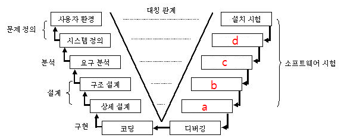

## 문제

다음은 V&V 모델을 형상화한 V다이어그램이다. 빈칸에 들어갈 말을 쓰시오.

정답 : a. 단위 테스트 b.통합 테스트 c. 시스템 테스트 d.인수 테스트

## 설명

| 테스트 종류  | 설명                                                                                                            |
|:-------:|:-------------------------------------------------------------------------------------------------------------:|
| 단위 테스트  | • 인터페이스 테스트 • 자료구조 테스트 • 수행경로 테스트                                                                             |
| 통합 테스트  | • 하향식 통합 • 상향식 통합 • 백본 통합                                                                                     |
| 시스템 테스트 | • 보안 테스트 • 민감도 테스트 • 성능 테스트                                                                                   |
| 인수 테스트  | • 알파 테스트 : 통제된 환경에서 선별된 사용자들(사내 직원 등)이 개발자와 함께 수행하는 테스트 • 베타 테스트 : 실제와 동일한 환경에서 사외의 사용자들이 테스트하게 하고 피드백을 받는 방법 |
