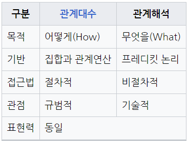

## 문제

다음은 관계 데이터 모델에 대한 설명이다. 괄호안에 들어가는 용어를 작성하시오.

(  )은/는 관계 데이터의 연산을 표현하는 방법으로, 원하는 정보를 정의할 때는 계산 수식을 사용한다.
수학의 predicate calculus에 기반을 두고 있으며, 관계 데이터 모델의 제안자인 codd가 수학에 가까운 기반을 두고 특별히 관계 데이터베이스를 위해 제안하여 탄생하였다.
( )은/는 원하는 정보가 무엇이라는 것만 정의하는 비절차적 특성을 지니며, 튜블( )와/과 도메인 ( )이/가 있다.

정답 : 관계해석

## 설명

### 관계대수와 관계해석 비교

